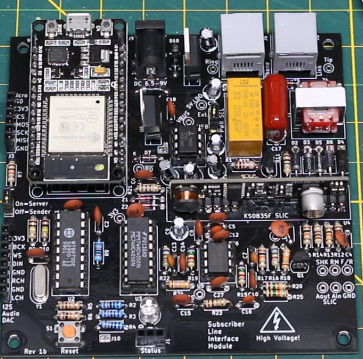

# Phone_SLIM
POTS Telephone Subscriber Line Interface Module
    
# Usage Notes
One pcb is needed for each phone/modem/etc.  One board has to have a jumper installed on J5 to act as a Server node and the other board(s) must have the jumper vacant to act as Sender nodes. 
The Server board must connect to a WiFi router to function properly.  The SSID and Password for the router must be defined by editing the "arduino_secrets.h" file before compiling the sketch. 
The telephone numbers are 7 digits long and are configured by editing the "project_globals.cpp" file and changing the numbers assigned to remotePhoneNumber and localPhoneNumber. 
The region can be configured by uncommenting the desired line in the "project_globals.cpp" file, setting myRegion equal to North America or UK.  

Each board should be powered from an external 5 volt DC supply capable of 500mA since each board can draw several hundred mA. 
USB power can be used for programming and some testing, but the board may not be as stable as when powered externally. 
Set the power jumper J8 for USB or EXT as needed.  

Power up the Server board first and wait for the blue LED to light up on the ESP module's built in LED to indicate it has joined the WiFi router. 
Then power up the Sender board so it can try to auto-pair with the Server board over ESP-NOW.  In the future, software may be improved so the Sender board will auto-pair whenever the Server board is ready.
